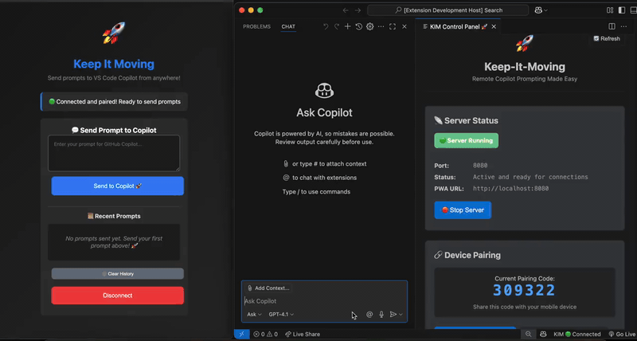
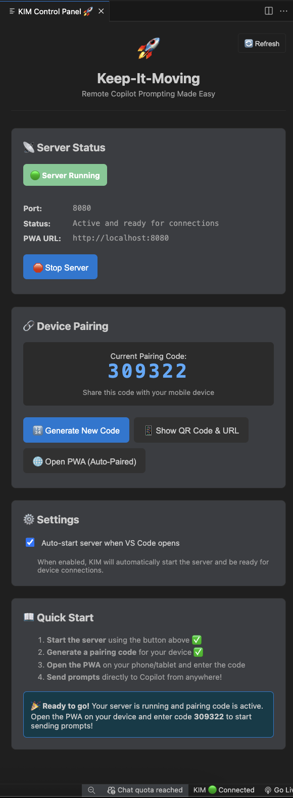

# Keep-It-Moving (KIM) 🚀

> Send prompts to VS Code Copilot from any device

## What is Keep-It-Moving? 

Keep-It-Moving (KIM) lets you send prompts to GitHub Copilot from your phone, tablet, or other devices. Install the VS Code extension, generate a pairing code, and start sending prompts remotely.

## See It In Action



*24-second demo showing the complete KIM workflow: VS Code extension → QR code pairing → mobile prompting → Copilot integration*

## Quick Start

### 1. Install VS Code Extension

**Option A: Build from Source (Required)**
```bash
git clone https://github.com/jmoncayo-pursuit/keep-it-moving.git
cd keep-it-moving/extension
npm install
npm run package
code --install-extension kim-vscode-extension-1.0.0.vsix --force
```

**Option B: Install from VSIX File**
If you have the `kim-vscode-extension-1.0.0.vsix` file:
```bash
code --install-extension kim-vscode-extension-1.0.0.vsix --force
```

> **Note**: This extension is not yet available on the VS Code Marketplace. You must build from source or install from a VSIX file.

### 2. Generate Pairing Code

**Option A: Control Panel (Recommended)**
1. Click the KIM status indicator in VS Code status bar
2. Click "Generate New Code" or use the displayed code
3. Server starts automatically if not running

**Option B: Command Palette**
1. Open VS Code Command Palette (Ctrl/Cmd+Shift+P)
2. Run: `KIM: Show Pairing Code` (auto-starts server)
3. QR code and pairing code appear in VS Code panel

### 3. Connect Your Device

**Option A: QR Code (Recommended)**
1. Scan QR code with your phone
2. PWA opens automatically
3. Enter the 6-digit code shown in VS Code
4. Start sending prompts!

**Option B: Manual**
1. Visit the URL shown in VS Code (e.g., `http://192.168.1.59:8080`)
2. Enter the 6-digit pairing code
3. Start sending prompts!

## Technical Features
- **Embedded Server**: WebSocket server running inside VS Code extension
- **Self-Hosting PWA**: Complete web app served directly from extension (no external hosting)
- **Dynamic Port Discovery**: Intelligent fallback system for reliable startup
- **Real-Time Integration**: Direct GitHub Copilot chat injection with sub-second delivery

### 🎉 **Joyful User Experience**  
- **QR Code Auto-Pairing**: Scan → auto-fill → connect seamlessly
- **Emoji-Driven Feedback**: 🚀📱🎉 throughout the experience
- **Playful Error Messages**: "Your coding session took a coffee break! ☕"
- **Stacked Notifications**: Beautiful, non-intrusive feedback system

### 🔐 **Enterprise-Grade Security**
- **UUID Token Authentication**: 122-bit cryptographic security
- **Session Management**: 24-hour expiry with automatic cleanup
- **Local-First**: Zero cloud dependencies, all traffic stays on your network
- **Multi-Device Support**: Unlimited simultaneous connections

## How It Works

1. VS Code extension starts an embedded WebSocket server
2. Extension serves a PWA directly from the extension
3. Extension generates a pairing code and QR code
4. Device scans QR code or visits URL to connect to PWA
5. Prompts sent from device appear instantly in VS Code Copilot chat

## Architecture

🏗️ **[View Detailed Architecture](./ARCHITECTURE.md)** - See the innovative embedded server design

🎉 **[View Major Milestones](./MILESTONES.md)** - Celebrate the technical breakthroughs

## Technical Highlights

### Performance-Optimized QR Code Sharing

We've implemented a lightweight notification-based approach for sharing QR codes:

- **Notification-Based**: Instead of resource-intensive hover functionality, QR codes are displayed via notifications
- **On-Demand Generation**: QR codes are only generated when explicitly requested
- **Two-Step Process**: Simple notification with pairing code first, full QR code only when needed
- **Improved Performance**: Eliminates VS Code slowdowns and freezes that occurred with hover-based implementation

### Seamless Copilot Integration

We've created a custom hook that elegantly integrates with VS Code's Chat API for effortless prompt delivery:

```javascript
// Seamless integration with VS Code Chat API
await vscode.commands.executeCommand('workbench.action.chat.open', {
    query: prompt
});
```

This elegant solution provides:
- **Instant Delivery**: Prompts appear immediately in Copilot chat
- **Native Integration**: Uses VS Code's official Chat API
- **Context Preservation**: Maintains conversation flow between prompts
- **Full Character Support**: Handles emoji and special characters perfectly

## Extension Commands

Once installed, KIM adds these commands to VS Code:

- **KIM: Toggle Server** - Start/stop the embedded server
- **KIM: Show Pairing Code** - Generate and display QR code for device pairing
- **KIM: Show Status** - View connection status and server info

### Control Panel Interface

KIM provides a comprehensive control panel accessible from the VS Code status bar. Click the KIM status indicator to open the control panel:



The control panel provides:
- **Server Status**: Real-time server status and port information
- **Device Pairing**: Current pairing code with one-click generation
- **Quick Actions**: Start/stop server, generate codes, open PWA
- **Settings**: Auto-start configuration and preferences
- **Quick Start Guide**: Step-by-step setup instructions

### Using the Extension

1. **Start the Server**: Use `KIM: Toggle Server` or check the KIM status in the status bar
2. **Generate Pairing Code**: Use `KIM: Show Pairing Code` to get your QR code
3. **Check Status**: Click the KIM status bar item or use `KIM: Show Status`
4. **Stop Server**: Use `KIM: Toggle Server` again to stop

### Troubleshooting

- **Server won't start**: Extension will automatically find an available port
- **No pairing code**: Make sure server is running first
- **VS Code slow**: Restart VS Code if you experience performance issues
- **Connection issues**: Restart the server using `KIM: Toggle Server`

## Development

### Prerequisites
- Node.js 16+
- VS Code with GitHub Copilot extension

### Setup
```bash
git clone https://github.com/jmoncayo-pursuit/keep-it-moving.git
cd keep-it-moving/extension
npm install
```

### Run Development

```bash
# Start the extension in development mode (includes embedded server)
npm run dev-extension
```

### Test Extension

Test the extension with a fresh VS Code instance:

```bash
# Cross-platform test (recommended)
npm run test-extension

# Or use bash script (macOS/Linux)
npm run test-extension-bash
```

This will:
1. Package the extension
2. Create a clean VS Code profile
3. Install the extension in the clean profile
4. Open VS Code with the root folder
5. Clean up the test profile when done

## Response Capture Research

We extensively researched capturing Copilot responses to enable bidirectional communication:

**Methods Tested:**
- ❌ **Chat Provider Hook** - VS Code Chat API not accessible
- ❌ **Extension Hook** - Copilot extension exports not usable  
- ❌ **Webview Interception** - Chat doesn't use interceptable webviews
- ❌ **Command Hook** - No response data in command execution

**Conclusion:** Response capture is not feasible with current VS Code/Copilot architecture. The system is designed to prevent external extensions from intercepting AI responses.

**Current Status:** KIM focuses on **prompt injection** (sending prompts from mobile to Copilot), which works perfectly. Response viewing requires checking VS Code directly.

## Future Features

- Voice prompts
- Team collaboration  
- Plugin ecosystem
- Enhanced mobile UI
- Prompt templates

## License

MIT License

---

<div align="center">

**Keep-It-Moving** - Remote Copilot Prompting Made Easy 🚀

#ForTheLoveOfCode

</div>